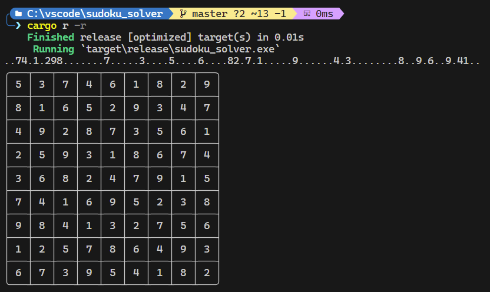

# Sudoku Solver

This is an implementation of a sudoku solver using the [`Crook's Algorithm`](http://www.ams.org/notices/200904/rtx090400460p.pdf) written in rust.

## Features
It can solve every level of sudoku puzzle.

It first attempts to solve without using guessing by using `forced cells` and then applying `preemptive sets` as per the paper.

If it cannot be solved and requires gussing, the puzzle is solved using `backtracking` (commonly known as `brute-forcing`).

## Usage

To run it locally, run

```bash
git clone https://github.com/blood-rogue/sudoku_solver.git
cd sudoku_solver

cargo r -r
```

Then provide the entire board as one line.

*Note: I used `.` in the example for blanks but you can use any character other than `1` to `9` for blank spaces*



## Testing
It is tested on 5 levels with 100 challenges each
- easy
- medium
- hard
- expert
- evil

You can run all tests by running (You need to clone it first)
```bash
$ cargo test
```

Or can run the test individually for each difficulty by running
```bash
# Replace <difficulty> with one of the above levels
$ cargo test test_<difficulty>
```

You can find the test puzzles in the `test/puzzles` directory.

## Inspirations

- [Damien Zhang's blog](http://damienzhang.com/sudoku/)
- `Combination` from [`itertools`](https://crates.io/crates/itertools) crate modified to use `IndexSet` as buffer

*Note: The link to Damien's blog seems to be broken. [web archive](https://web.archive.org/web/20210510205105/http://damienzhang.com/sudoku/)*